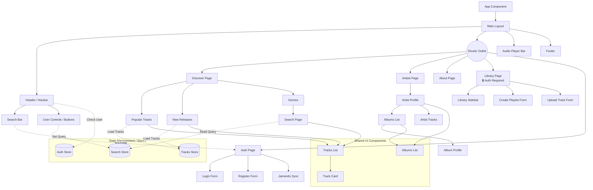

```mermaid
graph TD
    %% State Management (Stores)
    subgraph State [State Management / Stores]
        AuthStore[(Auth Store)]
        TrackStore[(Tracks Store)]
        SearchStore[(Search Store)]
    end

    App[App Component] --> MainLayout[Main Layout]

    %% Global Layout Widgets
    MainLayout --> Header[Header / Navbar]
    MainLayout --> RouterOutlet((Router Outlet))
    MainLayout --> AudioPlayer[Audio Player Bar]
    MainLayout --> Footer[Footer]

    %% Header Logic
    Header --> SearchBar[Search Bar]
    Header --> UserMenu[User Controls / Buttons]

    %% Data Flow from Header
    SearchBar -.->|Set Query| SearchStore
    Header -.->|Check User| AuthStore

    %% Main Pages (Routes)
    RouterOutlet --> Discover[Discover Page]
    RouterOutlet --> Artists[Artists Page]
    RouterOutlet --> About[About Page]
    RouterOutlet --> Library[Library Page <br> 🔒 Auth Required]
    RouterOutlet --> Auth[Auth Page]

    %% Shared UI Components
    subgraph SharedUI [Shared UI Components]
        TracksList[Tracks List]
        AlbumsList[Albums List]
        TrackCard[Track Card]
    end

    %% Internal Shared UI Links
    TracksList --> TrackCard

    %% Discover Branch
    Discover --> Popular[Popular Tracks]
    Discover --> NewRel[New Releases]
    Discover --> Genres[Genres]
    Genres --> SearchPage[Search Page]

    %% Discover Data & UI Flow
    Popular -.->|Load Tracks| TrackStore
    NewRel -.->|Load Tracks| TrackStore
    SearchPage -.->|Read Query| SearchStore

    Popular --> TracksList
    NewRel --> TracksList
    SearchPage --> TracksList

    %% Artists Branch
    Artists --> ArtistProfile[Artist Profile]
    ArtistProfile --> Albums[Albums List]
    ArtistProfile --> ArtistTracks[Artist Tracks]
    Albums --> AlbumProfile[Album Profile]

    ArtistProfile --> AlbumsList
    Albums --> AlbumsList

    %% Library Branch
    Library --> LibSidebar[Library Sidebar]
    Library --> CreatePlaylist[Create Playlist Form]
    Library --> UploadTrack[Upload Track Form]

    %% Auth Branch (Now correctly in Router Outlet)
    Auth --> Login[Login Form]
    Auth --> Register[Register Form]
    Auth --> Jamendo[Jamendo Sync]

    %% Navigation
    UserMenu -.->|Navigate| Auth
```
