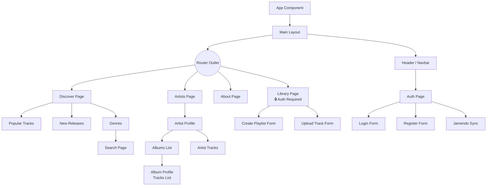

```mermaid
graph TD
    App[App Component] --> MainLayout[Main Layout]

    MainLayout --> Header[Header / Navbar]
    MainLayout --> RouterOutlet((Router Outlet))

    %% Main Pages (Routes)
    RouterOutlet --> Discover[Discover Page]
    RouterOutlet --> Artists[Artists Page]
    RouterOutlet --> About[About Page]
    RouterOutlet --> Library[Library Page <br> 🔒 Auth Required]

    %% Discover Branch
    Discover --> Popular[Popular Tracks]
    Discover --> NewRel[New Releases]
    Discover --> Genres[Genres]
    Genres --> SearchPage[Search Page]

    %% Artists Branch
    Artists --> ArtistProfile[Artist Profile]
    ArtistProfile --> Albums[Albums List]
    ArtistProfile --> ArtistTracks[Artist Tracks]
    Albums --> AlbumProfile[Album Profile <br> Tracks List]

    %% Library Branch (Your work)
    Library --> CreatePlaylist[Create Playlist Form]
    Library --> UploadTrack[Upload Track Form]

    %% Auth Branch (from Header)
    Header --> Auth[Auth Page]
    Auth --> Login[Login Form]
    Auth --> Register[Register Form]
    Auth --> Jamendo[Jamendo Sync]
```
